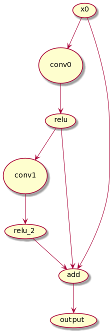
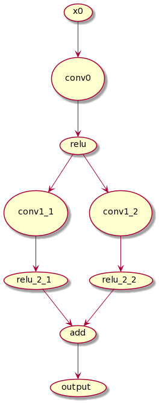
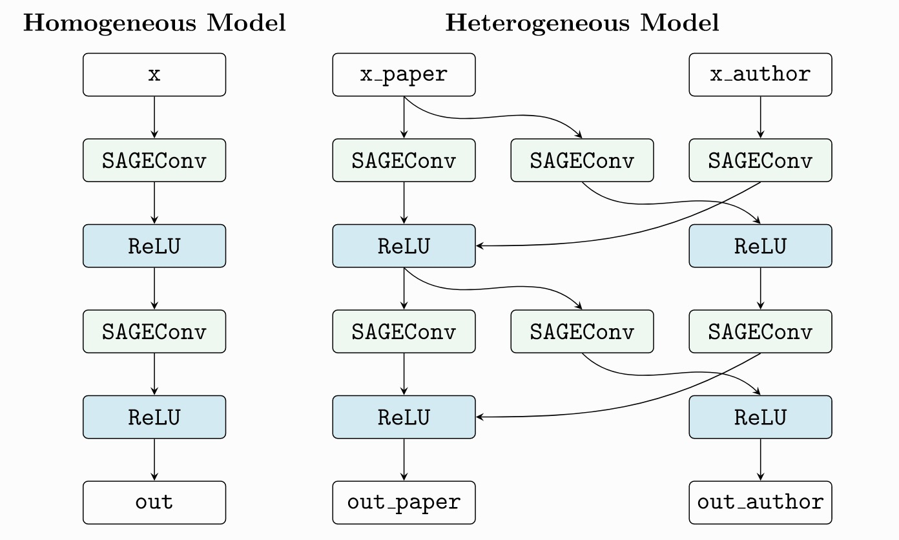

# 问题定义
In order to support GNN full neighbour sampling inference, we need to compute the features layer by layer. So first, we will split the forward function to several convolution functions. 

We show a simple case below. In this case, we can easily found that we can handle this problem by split the computation graph between conv0 and conv1.
It is obvious that:
1. The graph is Directed Acyclic Graph.
2. The graph contains several message passing nodes.

At first, the tensor value is the input $x_0$, which do not contains much information. After it encounter a message passing module, the output tensor contains richer information according to the input graph. We defined $d_i$ as how many massage passing module the tensor encountered. E.g., in the upper computation graph, $d_{x_0}=0$; $d_{conv_0}=1$; $d_{relu}=1$; $d_{conv_1}=2$... and so on. 

Here we simply think the computation graph is just like a linked list, but actually the relation of these nodes in the graph may contain residual. A node may no take inputs only from one node. We can't just consider how to cut a linked list, but to think about how to split a graph. We define that the inputs of node $i$ is $Input_i$, we may encounter the case that $d_i \ne d_j; i,\ j \in Input_i$. So we can compute $d_i$ as: 
$$d_i=max(d_j,\ j \in Input_i)$$

In the below computation graph, we can found that there is a formula $add=x_0+relu+relu_2$, while $d_{x_0}=0$, $d_{relu}=1$ and $d_{relu_2}=2$. In this case, we takes 
$$d_{add}=max(d_{x0},d_{relu},d_{relu_2})=2$$

We may also consider the cases which two message passing module takes the same inputs. This case actually is simliar to heterogenuous graph.

Which means, there exists two message passing module $i$ and $j$ that $d_i=d_i$.

We can turn this question into a more formulaic formulation. First, we transform the forward function to a operator dependency graph. The property of the graph is:
1. The graph is a directed acyclic graph
2. There are several message passing module nodes in the graph, we annotated them as $MP$.
3. Each node in the graph have a message passing degree $d_i$.
4. $d_i=max(d_j,\ j \in Input_i) + (i \in MP\ ?\ 1\ :\ 0)$.
5. We can split the graph where $d_i > d_j,\ j\in Input_i$.

给定一个有向无环图$G$，图中的节点$v_i$分为普通节点$v_{Ci}$和消息传递节点$v_{MPi}$。每个节点$v_i$和每条边$e_i$都有两个属性，一个是颜色$c_{i}$，另一个是权重$p_i$。初始状态下所有的节点以及边的的颜色都为白色。

我们可以对$G$做出以下操作：

1. 将一个白色的点染成黑色。
2. 将一条起点是黑色点的边染成黑色。

限制：使得任意两个$v_{MP}$之间的路径，一定包含黑色边。

目标：使所有黑色点和黑色边的权重$p$加和最小。

详细说明：将白色的点染成黑色表示将该点作为checkpoint，他的权重代表将数据从GPU转移到CPU的开销。黑色的边表示该数据传输从checkpoint传过去，权重代表将数据从CPU转移到GPU的开销。黑色的点的可以既有白色的边也有黑色的边，是因为我们在决定将该数据作为checkpoint时，不代表所有需要该数据的点都从checkpoint读出，也可以从GPU读出。我们的限制是，使得任意两个$v_{MP}$之间的路径包含黑色边，意思是两个消息传递module之间，一定要经过一次GPU-CPU-GPU的过程。我们的目标是使得所有黑点黑边权重加和最小，意思是所有的数据转移量最小。
